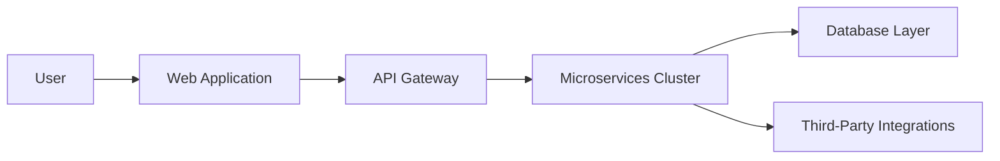

# APOLLON AI

Welcome to the official repository of **ApollonAI** – a pioneering project aimed at integrating advanced AI solutions with cloud technologies. Our ecosystem is designed to empower users through an intuitive web interface and robust backend services.

## Table of Contents
- [Web Application](#web-application)
- [Licensing & Rights](#licensing--rights)
- [Main Repositories](#main-repositories)
- [Global Architecture](#global-architecture)
- [Additional Resources](#additional-resources)
- [Contributing](#contributing)
- [Contact](#contact)

## Web Application

Experience our cutting-edge platform by visiting our main web app:  
[ApollonAIlonai.cloud](https://apollonai.cloud)

## Licensing & Rights

All projects under the ApollonAI organization are licensed under the [MIT License](LICENSE).  
© 2025 ApollonAI. All rights reserved.

## Main Repositories

Explore our core repositories:
- **[ApollonAI Web](https://github.com/ApollonAI/apol-web)** – The frontend interface for our web application.
- **[ApollonAI API](https://github.com/ApollonAI/apol-api)** – The backend services powering our platform.
- **[ApollonAI Infrastructure](https://github.com/ApollonAI/apol-infra)** – Automation, deployment, and infrastructure management.
- **[ApollonAI Documentation](https://github.com/ApollonAI/apol-docs)** – Detailed guides, API docs, and best practices.

## Global Architecture

Below is an overview of our system’s architecture, demonstrating the flow from user interactions to backend processes:

This diagram outlines:
- **User Interaction:** Users access the platform through the web app.
- **API Gateway:** Requests are managed and routed efficiently.
- **Microservices Cluster:** Core functionalities are modularized into services.
- **Database Layer:** Persistent data storage is handled securely.
- **Third-Party Integrations:** Seamless connections with external services.

## Additional Resources

- **Documentation:** Detailed developer guides and API references can be found in our [Documentation Repository](https://github.com/APOL/apol-docs).
- **Support:** For issues, feature requests, or general inquiries, please open an issue on our GitHub repositories or visit our [Contact Page](https://apollonai.cloud/contact).

## Contributing

We welcome contributions from the community!  
Please review our [Contribution Guidelines](CONTRIBUTING.md) for instructions on how to get started.

## Contact

For further questions or feedback, reach out to us via our [Contact Page](https://apollonai.cloud/contact).

---

© 2025 ApollonAI. All rights reserved.

